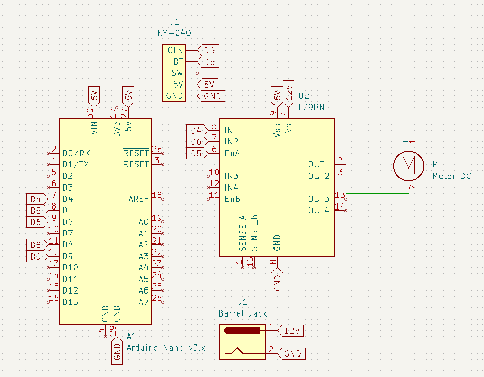
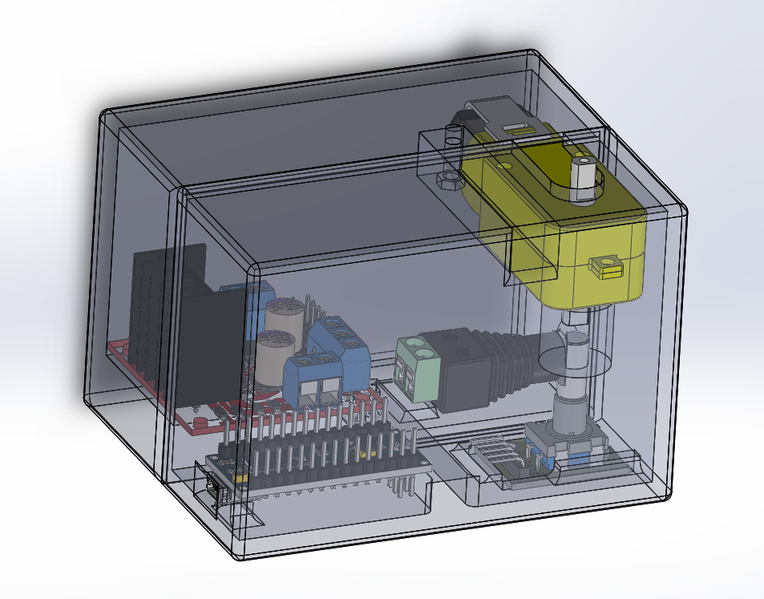

# Simple Haptic Knob

## Introduction
This is a simple and affordable Haptic Knob System that allows everyone to discover the beauty of Haptic systems. The components used for this project can be easily found and thus this project is very accessible.

## Components
- Arduino Nano
- L298N Motor Driver
- KY-040 Rotary Encoder
- Barrel Jack Connector

## Wiring

## 3D Printed Case

This is the 3D printed Case made to house the electronics it can be printed using either PLA or ABS on any commercial 3D printer.

## Programming
#### PID Controller
All the examples contain a PID Controller Class which is in charge of controlling the Motor through Proportional, Integral, Derivative Control. The Class has two functions. One is a constructor for the class which stores the gains and sample time. The other updates the output based on the error.

#### Encoder Reading
The KY-040 acts the same as any other incremental encoder. The A and B channel determine whether the encoder is moving clockwise or anticlockwise. The Loop checks whether or not Channel A is rising and then checks channel B to determine whether to increment or decrement the counter.

#### Sampling Loop
The millis() if condition block is responsible for updating the PID controller and sending its output to the motor driver.

## Examples
#### HoldPosition
This example holds the motor at the initial position and resists motion. The PID gains can be changed to alter the severity of the resistance.
#### ImaginaryWall
This example allows the motor to spin freely up to a certain limit at which the motor resists motion as if there were an imaginary wall.
#### TactileSwitch
This example allows the motor to simulate a rotary switch. The Switch resists the change until it's over a certain angle at which point it goes to the next setpoint.
#### SpeedControl
This example allows the motor to spin at a certain speed. The motor will try to maintain this speed and will resist stopping.
